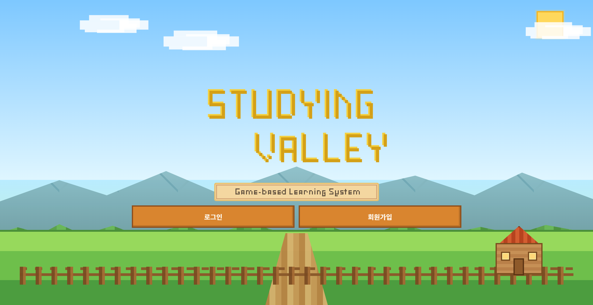

# StudyingVally

  
  
  

StudyingVally는 학생, 강사, 관리자가 함께 사용하는 학습 플랫폼 프로젝트입니다.
사용자는 회원가입과 로그인 후 아이디/비밀번호 찾기, 내 정보 조회·수정, 회원 탈퇴 등의 기능을 이용할 수 있으며, 권한에 따라 학생 화면, 강사 화면, 관리자 화면이 구분되도록 설계되었습니다.
Spring Boot, Spring Security, Spring Data JPA, Thymeleaf, MySQL을 기반으로 구현하여 인증·인가, 사용자 관리, 데이터 처리 흐름을 학습하고 적용하는 것을 목표로 한 프로젝트입니다.
스터딩 밸리는 초등학생들을 대상으로 한 LMS 시스템이다. 디지털 기기와 온라인 학습이 익숙한 현재 초등학생들이 더욱 재밌있고 거부감 없이 공부를 진행할 수 있도록 돕는 것을 목표로 하였다.
스타듀밸리 게임의 ui와 유사하게 제작하여 실제로 게임하는 것처럼 회원가입 하면 내 캐릭터가 생겨나고 방향키를 이용해 화면을 이동하며 공부가 아닌 하나의 게임이자 탐험으로 접근할 수 있도록 하였다.
